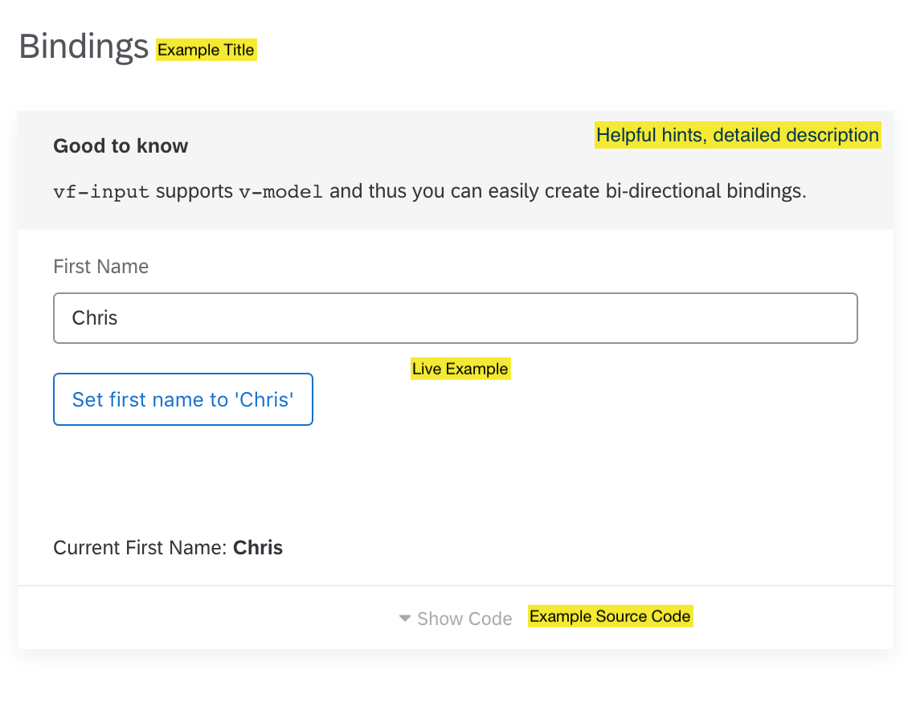

# New Component Guide

> This is a very brief guide which describes what you have to do in order to implement a new component for Fundamental-vue.

## Creating the files for the actual Component
For the purpose of this guide, lets assume that you want to create a component called `Flower`.

If the new component is so simple that it will fit in just a single file then you have to create just a single file:

```
$ touch src/components/Flower.tsx
```

If your component is more complex you will probably need more than one file. Maybe your component is a componsition made out of several other related components that you will implement. If that is the case create a folder instead that in turn contains all of your files. For example:

```
$ mkdir src/components/Flower
$ touch src/components/Flower/index.tsx
$ touch src/components/Flower/Flower.tsx
$ touch src/components/Flower/Blossom.tsx
$ touch src/components/Flower/Util.ts
```

Lets further assume that you are implementing a simple component.

## Implementing the Component


**src/components/Flower.tsx**

```js
import { componentName } from '@/util';

import {
  Component,
  Prop,
  Vue,
} from 'vue-property-decorator';

@Component({ name: componentName('Flower') })
export class Flower extends Vue {
  @Prop public color!: string;

  public render() {
    const style = {
      'background-color': color,
    }
    return <div style={style}>I am a Flower</div>
  }
}
```

Key points:

- `componentName('Flower')` is used to create the name for your component. By convention the string passed to `componentName` should be in CamelCase, starting with an uppercase letter and without any prefix. `componentName` will add the prefix for you.
- In order to improve interoperability default exports for components are avoided.
- `@Prop` iVars are suffixed with `!` in order to silence the compiler (false positive).

## Exporting the new Component

You have to export the new component:

**src/components/index.ts**

```diff
+ export * from './Flower'
+ import { Flower } from './Flower';
export const all = {
+ Flower
};
```

## Documenting the new Component
In order to make your component available to the public you have to document the component. A properly documented component consists of at least two things:

- Examples
- API Documentation

## Documenting the new Component: Examples
The image below shows a example for an existing component.



In order to create a example for your new component create the necessary files:

```shell
$ mkdir src/docs/pages/Flower
$ touch src/docs/pages/Flower/default.vue
$ touch src/docs/pages/Flower/index.ts
```

Examples are implemented as single file components (in our case `src/docs/pages/Flower/default.vue`) because this is what most Vue developers are using. You can put anything you want in the vue-file: a `<template>`-block, a `<script>`-block and a `<style>`-block. Fundamental Vue examples may contain additional documentation specific blocks. More about that later. For now lets simply implement the most basic example possible:

### Simple Example

**src/docs/pages/Flower/default.vue**

```xhtml
<template>
  <FdFlower color="red" />
</template>
```

You can include a `script` and/or `style` section if needed. If you declare custom styles make sure to make your `style`-section scoped.

### Improved Example

As already mentioned in the paragraph above, you can improve your example by using addional blocks. Namely:

- `<title>Example Title</title>`: Specify a title for your example. The title is displayed in a big font above your example.
- `<docs>Potentially long example description</docs>`: Describe the example in detail. This is displayed directly below the title. **Supports Markdown**
- `<tip>Short but useful tip related to the example/component.</tip>` If there is something important, especially useful or good to know fact use the `<tip>`-block. This is displayed in a highlighted box below the `<docs>`-block. **Supports Markdown**

**src/docs/pages/Flower/default.vue**

```xhtml
<title>Red Flower (Rose)</title>
<docs>Roses are **red**, __Violets__ are ~blue~, Sugar is sweet, And so are you.</docs>
<tip>Plant roses under trees for **best** results.</tip>
<template>
  <FdFlower color="red" />
</template>
```

### The `index.ts`-file
Remember: At the moment you have only a single example. However you can have multiple examples spread over multiple vue-files. It is not uncommon that your examples are related to not only a single component but make use of many different components.

You should list all components that are relevant for your examples. This information will be used to display the corresonding component API reference below the examples.

You do this by modifying the `index.ts`-file in `src/docs/pages/Flower/`. The contents of this file should look like this:

```js
import { ExampleCollectionFunction } from '../types';

export const plugin: ExampleCollectionFunction = () => {
  return { relatedComponents: [] };
};
```

By having the code above in the `index.ts`-file you basically say that your examples are not related to any component. The related components you return have to be instances of `VueConstructor`. You don't have to manually import the related components. The first argument of the `ExampleCollectionFunction` is an object which contains all components. So we can simply do this:

```js
import { ExampleCollectionFunction } from '../types';

export const plugin: ExampleCollectionFunction = ({ Flower }) => {
  return { relatedComponents: [Flower] };
};
```

## Documenting the new Component: API Documentation

Your new component may have props or emit custom events. You can document props and events directly in your custom component.

**src/components/Flower.tsx**

```js
import { componentName } from '@/util';
import { Api } from '@/api'; // <-- import Api-Doc Helper
import {
  Component,
  Prop,
  Vue,
} from 'vue-property-decorator';

@Component({ name: componentName('Flower') })

// Document the Component itself

@Api.Component(/* human readable name */'Alert', component => {
  component.addEvent('click', 'Sent when the Flower is clicked');
})
export class Flower extends Vue {
  @Prop
  @ApiProp('flower color', prop => {
    prop
      .types(String)
      .acceptValues('red', 'green', 'blue')
  })
  public color!: string;

  public render() {
    const style = {
      'background-color': color,
    }
    return <div style={style}>I am a Flower</div>
  }
}
```

The additional annotations it is now documented that the component emits a `click`-event (to be implemented :)) and has a prop named `color` of type `String` which accepts `red`, `green` and `blue` as values.

The API documentation of a component looks like this:


Every annotated and exported component is automatically documented.

## Enable static Component Attribute Checks

By using [JSX with Typescript](https://www.typescriptlang.org/docs/handbook/jsx.html) (let's refer to this combination as TSX from now on) we can take advantage of additional type safety. TSX differentiates between two element types:

1. **intrinsic elements**: These are elements that refer to something intrinsic to the environment. In our case the environment is a browser executing our Typescript/Javascript code. Prime examples of intrinsic elements are `div`, `span`, `button`, …. By convention, intrinsiv elements start with a lower case letter and accept any attribute. `<div i-am-a-non-existent-attribute="with an invalid value" />` does not cause a compiler warning. We could enable type checking even for intrinsic elements but for now this seemed like not so high on the list of things to do.
2. **value-based elements**: In our context, every element/component we implement falls into this category: Every element that is non-intrinsic is for our purpose, value-based. By convention value-based elements are be CamelCased. TSX has the ability to perform type checks on our value-based elements. Sadly this does not come for free. In order to enable static component attribute checks you have to tell the type system about every valid attribute your custom element/component supports.

We now come back to our example from earlier and enable the static attribute checks:

**src/components/Flower.tsx**

```js
import { componentName } from '@/util';
import { Api } from '@/api';
import {
  Component,
  Prop,
} from 'vue-property-decorator';
import TsxComponent from '@/vue-tsx';  // <-- import TsxComponent

// Declare our puplic props (again)
interface Props {
  color?: string;
}

@Component({ name: componentName('Flower') })

// Document the Component itself

@Api.Component(/* human readable name */'Alert', component => {
  component.addEvent('click', 'Sent when the Flower is clicked');
})
export class Flower extends TsxComponent<Props> { // <-- extend the TsxComponent
  @Prop
  @Api.Prop('flower color', prop => {
    prop
      .types(String)
      .acceptValues('red', 'green', 'blue')
  })
  public color!: string;

  public render() {
    const style = {
      'background-color': color,
    }
    return <div style={style}>I am a Flower</div>
  }
}
```

Declaring our public interface id done twice (by using @Prop and by declaring the Prop-interface). There are third party projects that work around this problem but this low-tech and redundant solution seemed acceptable.

## @Api-Decorators

### @Api.component(humanReadableName, builder?)

Annotate your component with this decorator to give it a human readable name. The optional builder allows you to document events emitted by this component.

* **Arguments:**
  * `humanReadableName: string` human readable component name
  * `builder?: (builder: Api) → void` (optional) builder to further document the component. **deprecated - no replacement available, yet**

> **Important**
>
> You have to use `@Api.component` **after** using the `@Component`-decorator. Otherwise it won't work properly.

### @Api.slot(name, description?)

Annotate your component with this decorator to specify available slots.

* **Arguments:**
  * `name: string` name of the slot (must not be human readable)
  * `description?: string` brief description of the slot

### @Api.defaultSlot(description)

Annotate your component with this decorator to describe the default slot (if available).

* **Arguments:**
  * `description: string` brief description of the slot

### @Api.prop(description, builder?)

You can use this decorator in order to document your props.

* **Arguments:**
  * `description: string` brief description of the slot
  * `builder: (builder: ApiProp) → void` optional builder to further customize the prop documentation.

### ApiProp

* **Methods:**
  * `acceptValues(...values: (number | string)[]): ApiProp` defines valid prop values
  * `type(...types: PropType[]): ApiProp` defines prop types

> **Good to know**
>
> Both methods return `this` so you can easily chain them. For example:
> ```js
> @Api.Prop('first name', prop => {
>   prop
>     .type(String, Number)
>     .acceptValues('chris', 123)
> )
> @Prop({ type: [String, Number], default: null })
> public firstName!: string | null;
> ```

## Known Issues
* Parameters of events can be annotated but are not displayed - yet.
* Props and Events gained by mixins are not displayed.
