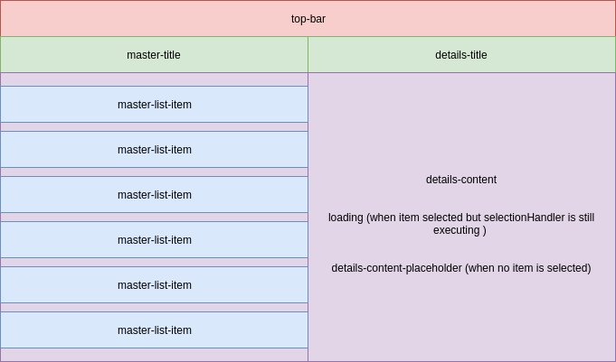

---
fdRelatedComponents:
  - fd-master-details
---
# Master Details

::: tip CSS NEEDED & BETA NOTICE

The Master Details-related components require some additional CSS that is not part of Fundamental Styles. If you want to use the master detail-related components you have to inlude the extra **Fundamental Vue CSS** file. It is part of the NPM package in `dist`. It is also available at [https://unpkg.com/fundamental-vue](https://unpkg.com/fundamental-vue@latest/dist/FundamentalVue.umd.css)

The Master Details-related components are in **beta**.

:::

This component provides a standardized master-details layout. The master section contains a list, whereas the details section's content is completely up to the developer. The `fd-master-details` component, exposes multiple props and slots allowing the consumer to customize the layout.


## How does it work?

The master section uses either `fd-list-group` or `fd-virtualized-list` to render the `master-items` array. Once an item of the master list is clicked, an event is triggered internally, and the selected item will be passed to the `selection-handler`. The result of this function will then be passed to the `details-content` scoped slot where the consumer can render anything they want. By default, the `selection-handler` is just a function that returns the item that was passed to it. However, you can pass your own function that could do something like fetching details from an API based on the item's id.

::: tip

**Note**: on devices with a small screen (you can control the breakpoints), the `details` section's content will be automatically
placed inside an `fd-modal` allowing the `master` section to take up all the available width.

:::


## Simple example

The simplest way to use it, would be by passing the `master-items` prop and populating the `details-content` slot (since it is empty by default).

<d-example name="default">
</d-example>

## Customizing the Layout

The component exposes `master-width` and `gap` props to control the with of the master column and that of the gap between the 2 columns. By default, the `master-width` is set to 50% and the `gap` is set to 0. The details column will always automatically take up the remaining space.
You can pass the size that you want is either pixels or percentage, e.g: '50%', '20px'...

Use the sliders in the example below to see how the layout changes when changing the aforementioned props
<d-example name="layout">
</d-example>

## Using a Virtualized List

As we have mentioned before, the component can either user `fd-list-group` or `fd-virtualized-list` under the hood. To use the virtualized list, you need to set the `use-virtualized-list` prop to `true`. You can then pass an object that contains all the props that you would usually pass to the `fd-virtualized-list`. The `fd-master-details` uses a default configuration object which means you can choose to only pass the properties that you wish to override. The defaults are:

```js
defaultVirtualizedListConfig: {
        keyField: "id",
        minItemSize: 50,
        loadMoreItems: function(done) {
          done();
        }
}
```

::: tip

**Note**: unlike the regular list, the virtualized one needs a unique keyField, therefore make sure that your array items have that.

:::

<d-example name="virtualized">
</d-example>


## Slots

This component exposes multiple slots allowing you to customize the contents of the sections' title and content. You can see how the slots are positioned in the image below.



Below is an example making full use of all the available slots (it also simulates an API call by sleeping for 800ms to showcase the `loading` slot)

<d-example name="full">
</d-example>

## Mobile Settings

In order to ensure a more responsive design, the component exposes `auto-open-modal`, `mobile-modal-styles` and `mobile-breakpoints` props allowing the developer to control when should the `details` switch to an `fd-modal` and how should the modal look like. By default, the modal will be fullscreen and will be triggered on the `Breakpoints.XSmall` breakpoint.

Below is an example that makes use of these props to customize the mobile behavior of the component.

<d-example name="mobile">
</d-example>


## Fullscreen

This could also be used as the main fullscreen layout for your page or application. By setting the `fullscreen` prop to `true` the component will automatically take up all the screen and apply some styles.

<d-example fullscreen-only name="fullscreen">
</d-example>